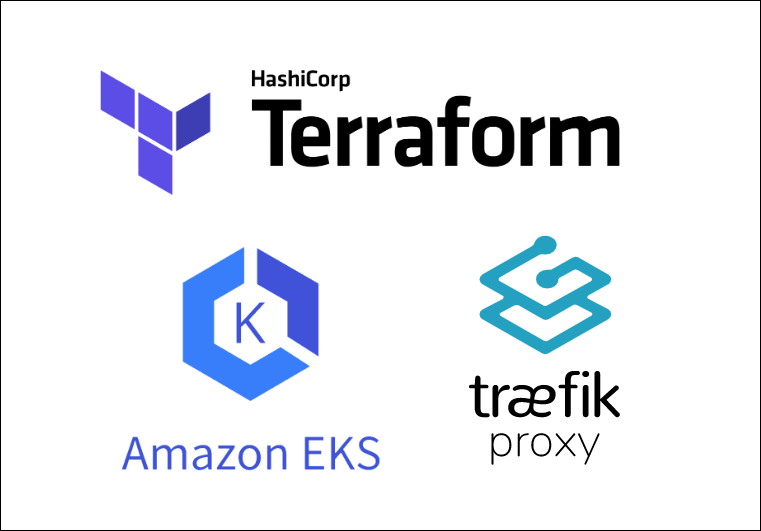

# terraform-aws-traefik-eks

<p align="center">
  
</p>

Terraform module to deploy Traefik into an Amazon AWS EKS Kubernetes cluster using an Application Load Balancer (using aws-load-balancer-controllor) and Certificates from AWS Certificate Manager.

A Route53 record is also created to point to the ALB, for example `traefik.example.com` you can also provide a list of subject alternative names (SANs) to provide additional hostnames for the certificate or you can create a wildcard certificate for the domain.

If you want to add additional configuration for Traefik using the Helm chart values, you can provide a `values.yaml` file and use the `values` variable to pass the contents of the file to the module. We recommend using the `templatefile` function to read the file contents and pass it to the module.

## Usage

```hcl
module "traefik" {
  source = "github.com/sculley/terraform-aws-traefik-eks"

  alb_name                  = "traefik-alb"
  alb_name_prefix           = "traef-"
  backend_port              = 80
  chart_version             = "20.8.0"
  deregistration_delay      = 60
  fqdn                      = "traefik.example.com"
  http_port                 = 80
  https_port                = 443
  inbound_cidrs             = ["8.8.8.8/32"]
  namespace                 = "traefik"
  outbound_cidrs            = ["0.0.0.0/0"]
  public_subnet_ids         = ["subnet-1234567890", "subnet-0987654321", "subnet-1234567890"]
  release_name              = "traefik"
  security_group_name       = "traefik-alb-sg"
  subject_alternative_names = ["*.example.com"]
  values                    = templatefile("${path.module}/values.yaml", {})
  vpc_id                    = "VPC_ID"
  zone_id                   = "ZONE_ID"
}
```

## Requirements

### aws-load-balancer-controller

The AWS Load Balancer Controller manages AWS Elastic Load Balancers for a Kubernetes cluster, allowing you to use Kubernetes resources to configure application load balancers and target groups. The AWS Load Balancer Controller is a controller for the Kubernetes service that enables you to create Application Load Balancers and Network Load Balancers for your Kubernetes services. We use the AWS Load Balancer Controller to create the Application Load Balancer for Traefik, so it is required to be installed in the cluster before deploying Traefik using this module. See the link below for more information.

- [AWS Guide](https://docs.aws.amazon.com/eks/latest/userguide/aws-load-balancer-controller.html)
- [Helm Chart](https://artifacthub.io/packages/helm/aws/aws-load-balancer-controller)

## Providers

| Name | Version |
|------|---------|
| <a name="provider_aws"></a> [aws](#provider\_aws) | n/a |
| <a name="provider_helm"></a> [helm](#provider\_helm) | n/a |
| <a name="provider_kubectl"></a> [kubectl](#provider\_kubectl) | n/a |

## Modules

| Name | Source | Version |
|------|--------|---------|
| <a name="module_acm"></a> [acm](#module\_acm) | terraform-aws-modules/acm/aws | ~> 3.0 |
| <a name="module_alb"></a> [alb](#module\_alb) | terraform-aws-modules/alb/aws | ~> 6.0 |

## Resources

| Name | Type |
|------|------|
| [aws_route53_record.this](https://registry.terraform.io/providers/hashicorp/aws/latest/docs/resources/route53_record) | resource |
| [aws_security_group.this](https://registry.terraform.io/providers/hashicorp/aws/latest/docs/resources/security_group) | resource |
| [helm_release.this](https://registry.terraform.io/providers/hashicorp/helm/latest/docs/resources/release) | resource |
| [kubectl_manifest.this](https://registry.terraform.io/providers/hashicorp/kubectl/latest/docs/resources/manifest) | resource |

## Inputs

| Name | Description | Type | Default | Required |
|------|-------------|------|---------|:--------:|
| <a name="input_alb_name"></a> [alb\_name](#input\_alb\_name) | (Optional) Name of the ALB. If omitted, the default name will be used. Default: `traefik-alb` | `string` | `"traefik-alb"` | no |
| <a name="input_alb_name_prefix"></a> [alb\_name\_prefix](#input\_alb\_name\_prefix) | (Optional) Name prefix of the ALB. If omitted, the default name prefix will be used. Default: `traef-` | `string` | `"traef-"` | no |
| <a name="input_backend_port"></a> [backend\_port](#input\_backend\_port) | (Optional) The port on which the Traefik service is listening. Default: `80` | `number` | `80` | no |
| <a name="input_chart_version"></a> [chart\_version](#input\_chart\_version) | (Optional) Version of the Traefik Helm chart. If omitted, the default version will be used. Default: `20.8.0` | `string` | `"20.8.0"` | no |
| <a name="input_deregistration_delay"></a> [deregistration\_delay](#input\_deregistration\_delay) | (Optional) The amount time for ALB TargetGroup to wait before changing the state of a deregistering target from draining to unused. Default: `60` | `number` | `60` | no |
| <a name="input_fqdn"></a> [fqdn](#input\_fqdn) | The fully qualified domain name to create the certificate for Traefik and Route53 record | `string` | n/a | yes |
| <a name="input_http_port"></a> [http\_port](#input\_http\_port) | (Optional) The port on which the Traefik service is listening. Default: `80` | `number` | `80` | no |
| <a name="input_https_port"></a> [https\_port](#input\_https\_port) | (Optional) The port on which the Traefik service is listening. Default: `443` | `number` | `443` | no |
| <a name="input_inbound_cidrs"></a> [inbound\_cidrs](#input\_inbound\_cidrs) | List of CIDR blocks to allow inbound traffic from to the Traefik ALB. | `list(string)` | n/a | yes |
| <a name="input_namespace"></a> [namespace](#input\_namespace) | (Optional) Namespace in an Amazon EKS cluster to deploy Traefik to. Default: `traefik` | `string` | `"traefik"` | no |
| <a name="input_outbound_cidrs"></a> [outbound\_cidrs](#input\_outbound\_cidrs) | (Optional) List of CIDR blocks to allow outbound traffic to. Default: `[0.0.0.0/0]` | `list(string)` | <pre>[<br>  "0.0.0.0/0"<br>]</pre> | no |
| <a name="input_public_subnet_ids"></a> [public\_subnet\_ids](#input\_public\_subnet\_ids) | List of public subnet IDs to creaate the Traefik ALB in. | `list(string)` | n/a | yes |
| <a name="input_release_name"></a> [release\_name](#input\_release\_name) | (Optional) Name of the Traefik Helm chart. If omitted, the default name will be used. Default: `traefik` | `string` | `"traefik"` | no |
| <a name="input_security_group_name"></a> [security\_group\_name](#input\_security\_group\_name) | (Optional) Name of the security group. If omitted, the default name will be used. Default: `traefik-alb-sg` | `string` | `"traefik-alb-sg"` | no |
| <a name="input_subject_alternative_names"></a> [subject\_alternative\_names](#input\_subject\_alternative\_names) | (Optional) List of additional FQDNs to create the certificate for Traefik and Route53 record | `list(string)` | `null` | no |
| <a name="input_values"></a> [values](#input\_values) | (Optional) Use the templatefile function to pass through additional configuration for Traefik using the Helm values.yaml. Default: `""` | `string` | `""` | no |
| <a name="input_vpc_id"></a> [vpc\_id](#input\_vpc\_id) | VPC ID to create the Traefik ALB in. | `string` | n/a | yes |
| <a name="input_zone_id"></a> [zone\_id](#input\_zone\_id) | Route53 zone ID to create a dns record to point the fdqn to the Traefik ALB. | `string` | n/a | yes |

## Outputs

| Name | Description |
|------|-------------|
| <a name="output_acm_certificate_arn"></a> [acm\_certificate\_arn](#output\_acm\_certificate\_arn) | The ARN of the ACM certificate for Traefik's ALB |
| <a name="output_https_listener_arns"></a> [https\_listener\_arns](#output\_https\_listener\_arns) | The ARNs of the HTTPS load balancer listeners created for Traefik |
| <a name="output_lb_dns_name"></a> [lb\_dns\_name](#output\_lb\_dns\_name) | The dns/hostname of the Traefik ALB |
| <a name="output_target_group_arn"></a> [target\_group\_arn](#output\_target\_group\_arn) | The arn of the Traefik ALB Target Group |

## Authors

Module is maintained by [Sam Culley](https://github.com/sculley)